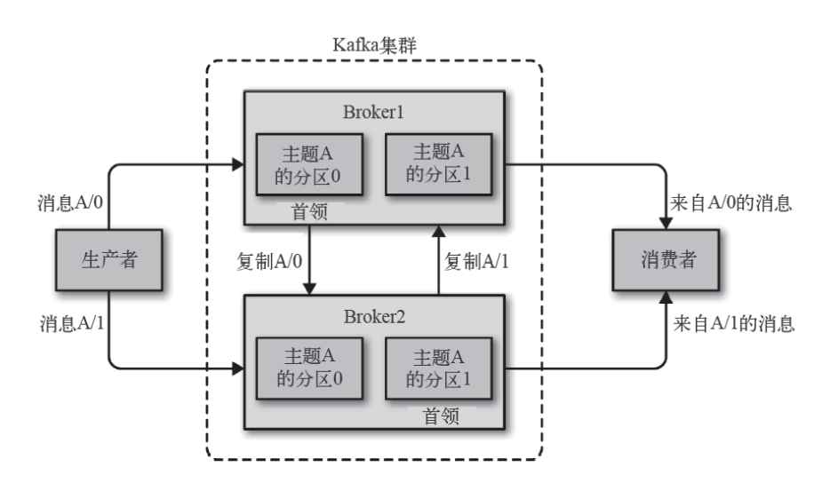
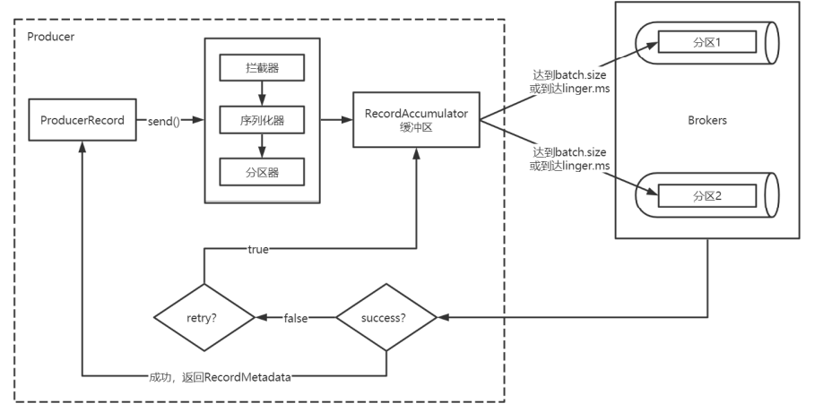
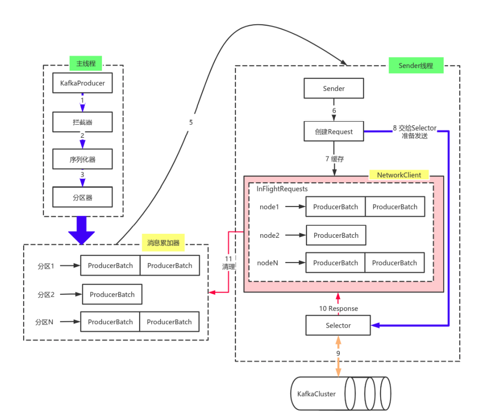

# 	Kfaka架构和实战

## 概念和基本架构

### Kafka应用场景

- 日志收集：一个公司可以用Kafka可以收集各种服务的Log，通过Kafka以统一接口服务的方式开放 给各种Consumer；
- 消息系统：解耦生产者和消费者、缓存消息等；
- 用户活动跟踪：Kafka经常被用来记录Web用户或者App用户的各种活动，如浏览网页、搜索、点击 等活动，这些活动信息被各个服务器发布到Kafka的Topic中，然后消费者通过订阅这些Topic来做实时的 监控分析，亦可保存到数据库；
- 运营指标：Kafka也经常用来记录运营监控数据。包括收集各种分布式应用的数据，生产各种操作的 集中反馈，比如报警和报告；
- 流式处理：比如Spark Streaming和Storm。

### 基本架构

- 消息和批次

  kafka的数据单元成为消息，可以把消息理解成数据库里的一行数据，消息由字节数组组成

  消息有键，键也是字节数组

  为了提高效率，消息被分批写入kafka，一批消息属于同一主题和分区，这样做可以减少网络开销，提升数据传输和存储能力，但是会加大计算处理压力

- 模式

  消息模式（schema）有许多可用的选项，以便于理解。如JSON和XML，但是它们缺乏强类型处理 能力。Kafka的许多开发者喜欢使用Apache Avro。Avro提供了一种紧凑的序列化格式，模式和消息体分 开。当模式发生变化时，不需要重新生成代码，它还支持强类型和模式进化，其版本既向前兼容，也向 后兼容。

  数据格式的一致性对Kafka很重要，因为它消除了消息读写操作之间的耦合性。

- 主题和分区

  kafka消息通过主题进行分类，主题相当于数据库的表，主题可以被分为若干分区，一个主题通过分区分布在kafka集群上，提供了横向扩展能力

- 生产者和消费者

  生产者在默认情况下把消息均衡地分布到主题的所有分区上：

  - 直接指定消息分区
  - 根据消息的key散列值取模获取发送分区
  - 轮询指定分区

  消费者通过偏移量来区分已经读过的消息，从而消费消息。

  消费者是消费组的一部分。消费组保证每个分区只能被一个消费者使用，避免重复消费。

- broker和集群

  一个独立的kafka服务器被称为broker，broker接收生产者的消息，为消息设置偏移量，并提交消息到磁盘保存，borker为消费者提供服务，对读取分区的请求做响应，返回已经提交到磁盘上的消 息。单个broker可以轻松处理数千个分区以及每秒百万级的消息量。

  

每个集群都有一个broker是集群控制器（自动从集群活跃成员中选举）

控制器的主要工作

- 将分区分配给broker
- 监控broker

集群中一个分区属于一个broker，这个broker称为这个分区的分区首领，分区也会有复制分区在别的broker上做备份处理，当分区首领宕机后由集群控制器重新分配分区首领，分区的复制提供了消息冗余，高可用，作为副本的分区不处理消息的读写，仅作为消息备份

### 核心概念

#### producer 生产者

生产者创建消息。 该角色将消息发布到Kafka的topic中。broker接收到生产者发送的消息后，broker将该消息追加到 当前用于追加数据的 segment 文件中。

一般情况下，一个消息会被发布到一个特定的主题上。

1. 默认情况下通过轮询把消息均衡地分布到主题的所有分区上。
2. 在某些情况下，生产者会把消息直接写到指定的分区。这通常是通过消息键和分区器来实现 的，分区器为键生成一个散列值，并将其映射到指定的分区上。这样可以保证包含同一个键的 消息会被写到同一个分区上。
3. 生产者也可以使用自定义的分区器，根据不同的业务规则将消息映射到分区。

#### consumer 消费者

1. 消费者订阅一个或多个主题，并按照消息生成的顺序读取它们。 
2. 消费者通过检查消息的偏移量来区分已经读取过的消息。偏移量是另一种元数据，它是一个不 断递增的整数值，在创建消息时，Kafka 会把它添加到消息里。在给定的分区里，每个消息的 偏移量都是唯一的。消费者把每个分区最后读取的消息偏移量保存在Zookeeper 或Kafka 上，如果消费者关闭或重启，它的读取状态不会丢失。
3. 消费者是消费组的一部分。群组保证每个分区只能被一个消费者使用。 
4. 如果一个消费者失效，消费组里的其他消费者可以接管失效消费者的工作，再平衡，分区重新 分配。

#### Broker 节点

一个独立的Kafka 服务器被称为broker。 broker 为消费者提供服务，对读取分区的请求作出响应，返回已经提交到磁盘上的消息。

1. 如果某topic有N个partition，集群有N个broker，那么每个broker存储该topic的一个 partition。
2. 如果某topic有N个partition，集群有(N+M)个broker，那么其中有N个broker存储该topic的一 个partition，剩下的M个broker不存储该topic的partition数据。 
3. 如果某topic有N个partition，集群中broker数目少于N个，那么一个broker存储该topic的一 个或多个partition。在实际生产环境中，尽量避免这种情况的发生，这种情况容易导致Kafka 集群数据不均衡。

broker 是集群的组成部分。每个集群都有一个broker 同时充当了集群控制器的角色（自动从集群 的活跃成员中选举出来）。

控制器负责管理工作，包括将分区分配给broker 和监控broker。 在集群中，一个分区从属于一个broker，该broker 被称为分区的首领。

#### Topic 主题

每条发布到Kafka集群的消息都有一个类别，这个类别被称为Topic。 物理上不同Topic的消息分开存储。 主题就好比数据库的表，尤其是分库分表之后的逻辑表。

#### Partition 分区

1. 主题可以被分为若干个分区，一个分区就是一个提交日志。 
2. 消息以追加的方式写入分区，然后以先入先出的顺序读取。 
3. 无法在整个主题范围内保证消息的顺序，但可以保证消息在单个分区内的顺序。 
4. Kafka 通过分区来实现数据冗余和伸缩性。 
5. 在需要严格保证消息的消费顺序的场景下，需要将partition数目设为1。

#### Replicas 副本

Kafka 使用主题来组织数据，每个主题被分为若干个分区，每个分区有多个副本。那些副本被保存 在broker 上，每个broker 可以保存成百上千个属于不同主题和分区的副本。

副本有以下两种类型：

- 首领副本： 每个分区都有一个首领副本。为了保证一致性，所有生产者请求和消费者请求都会经过这个副本。
- 跟随者副本： 首领以外的副本都是跟随者副本。跟随者副本不处理来自客户端的请求，它们唯一的任务就是从首 领那里复制消息，保持与首领一致的状态。如果首领发生崩溃，其中的一个跟随者会被提升为新首领。

#### Offset 偏移量

**生产者Offset**

消息写入的时候，每一个分区都有一个offset，这个offset就是生产者的offset，同时也是这个分区 的最新最大的offset。

**消费者Offset**

这是某一个分区的offset情况，生产者写入的offset是最新最大的值是12，而当Consumer A进行消 费时，从0开始消费，一直消费到了9，消费者的offset就记录在9，Consumer B就纪录在了11。等下一 次他们再来消费时，他们可以选择接着上一次的位置消费，当然也可以选择从头消费，或者跳到最近的 记录并从“现在”开始消费。

## kafka安装与配置

### 安装java环境

### 安装Zookeeper

## kafka实战开发

### 消息的发送与接收

#### 生产者

生产者主要的对象有： KafkaProducer ， ProducerRecord 。

其中 KafkaProducer 是用于发送消息的类， ProducerRecord 类用于封装Kafka的消息。 KafkaProducer 的创建需要指定的参数和含义：

| 参数              |                             说明                             |
| ----------------- | :----------------------------------------------------------: |
| bootstrap.servers | 配置生产者如何与broker建立连接。该参数设置的是初始化参数。如果生 产者需要连接的是Kafka集群，则这里配置集群中几个broker的地址，而不 是全部，当生产者连接上此处指定的broker之后，在通过该连接发现集群 中的其他节点。 |
| key.serializer    | 要发送信息的key数据的序列化类。设置的时候可以写类名，也可以使用该 类的Class对象。 |
| value.serializer  | 要发送消息的alue数据的序列化类。设置的时候可以写类名，也可以使用该 类的Class对象。 |
| acks              | 默认值：all。 acks=0： 生产者不等待broker对消息的确认，只要将消息放到缓冲区，就认为消息 已经发送完成。 该情形不能保证broker是否真的收到了消息，retries配置也不会生效。发 送的消息的返回的消息偏移量永远是-1。 acks=1 表示消息只需要写到主分区即可，然后就响应客户端，而不等待副本分区的 确认。 在该情形下，如果主分区收到消息确认之后就宕机了，而副本分区还没来得 及同步该消息，则该消息丢失。 acks=all 首领分区会等待所有的ISR副本分区确认记录。 该处理保证了只要有一个ISR副本分区存活，消息就不会丢失。 这是Kafka最强的可靠性保证，等效于 acks=-1 |
| retries           | retries重试次数 当消息发送出现错误的时候，系统会重发消息。 跟客户端收到错误时重发一样。 如果设置了重试，还想保证消息的有序性，需要设置 MAX_IN_FLIGHT_REQUESTS_PER_CONNECTION=1 否则在重试此失败消息的时候，其他的消息可能发送成功了 |

其他参数可以从 org.apache.kafka.clients.producer.ProducerConfig 中找到。我们后面的内 容会介绍到。 消费者生产消息后，需要broker端的确认，可以同步确认，也可以异步确认。 同步确认效率低，异步确认效率高，但是需要设置回调对象。

```java
package com.mylsaber.kafka;

import org.apache.kafka.clients.producer.KafkaProducer;
import org.apache.kafka.clients.producer.ProducerRecord;
import org.apache.kafka.clients.producer.RecordMetadata;
import org.apache.kafka.common.header.Header;
import org.apache.kafka.common.header.internals.RecordHeader;

import java.nio.charset.StandardCharsets;
import java.util.ArrayList;
import java.util.HashMap;
import java.util.List;
import java.util.concurrent.ExecutionException;
import java.util.concurrent.Future;

/**
 * @author jfw
 */
public class MyProducer {
    public static void main(String[] args) throws ExecutionException, InterruptedException {
        HashMap<String, Object> config = new HashMap<>(5) {{
            put("bootstrap.servers", "124.223.91.119:9092");
            put("key.serializer", "org.apache.kafka.common.serialization.IntegerSerializer");
            put("value.serializer", "org.apache.kafka.common.serialization.StringSerializer");
//            put("acks", "all");
//            put("retries", 3);
        }};
        KafkaProducer<Integer, String> integerStringKafkaProducer = new KafkaProducer<>(config);
        List<Header> header = new ArrayList<>();
        header.add(new RecordHeader("header", "producer.demo".getBytes(StandardCharsets.UTF_8)));
        ProducerRecord<Integer, String> producerRecord = new ProducerRecord<>("topic_1", 0, 0, "hello kafka", header);
        Future<RecordMetadata> future = integerStringKafkaProducer.send(producerRecord);
        RecordMetadata recordMetadata = future.get();
        System.out.println("消息的主题" + recordMetadata.topic());
        System.out.println("消息的分区号" + recordMetadata.partition());
        System.out.println("消息的偏移量" + recordMetadata.offset());
        System.out.println("---------------回调异步等待消息-------------------");
        integerStringKafkaProducer.send(producerRecord, (recordMetadata1, e) -> {
            System.out.println("消息的主题" + recordMetadata1.topic());
            System.out.println("消息的分区号" + recordMetadata1.partition());
            System.out.println("消息的偏移量" + recordMetadata1.offset());
        });
        integerStringKafkaProducer.close();
    }
}
```

#### 消费者

消费者主要的对象有： KafkaConsumer 用于消费消息的类。 KafkaConsumer 的创建需要指定的参数和含义：

|        参数        |                             说明                             |
| :----------------: | :----------------------------------------------------------: |
| bootstrap.servers  |             与Kafka建立初始连接的broker地址列表              |
|  key.deserializer  |                       key的反序列化器                        |
| value.deserializer |                      value的反序列化器                       |
|      group.id      |          指定消费组id，用于标识该消费者所属的消费组          |
| auto.offset.reset  | 当Kafka中没有初始偏移量或当前偏移量在服务器中不存在（如，数据被删 除了），该如何处理？ earliest：自动重置偏移量到最早的偏移量 latest：自动重置偏移量为最新的偏移量 none：如果消费组原来的（previous）偏移量不存在，则向消费者抛异常 anything：向消费者抛异常 |

ConsumerConfig类中包含了所有的可以给KfakaConsumer配置的参数。

```java
package com.mylsaber.kafka;

import org.apache.kafka.clients.consumer.ConsumerConfig;
import org.apache.kafka.clients.consumer.ConsumerRecords;
import org.apache.kafka.clients.consumer.KafkaConsumer;
import org.apache.kafka.common.serialization.IntegerDeserializer;
import org.apache.kafka.common.serialization.StringDeserializer;

import java.time.Duration;
import java.util.HashMap;
import java.util.List;

/**
 * @author jfw
 */
public class MyConsumer {
    public static void main(String[] args) {
        HashMap<String, Object> config = new HashMap<>(5) {{
            put(ConsumerConfig.BOOTSTRAP_SERVERS_CONFIG, "124.223.91.119:9092");
            put(ConsumerConfig.KEY_DESERIALIZER_CLASS_CONFIG, IntegerDeserializer.class);
            put(ConsumerConfig.VALUE_DESERIALIZER_CLASS_CONFIG, StringDeserializer.class);
            put(ConsumerConfig.GROUP_ID_CONFIG, "consumer.demo");
            put(ConsumerConfig.AUTO_OFFSET_RESET_CONFIG, "earliest");
        }};
        KafkaConsumer<Integer, String> integerStringKafkaConsumer = new KafkaConsumer<>(config);
        final List<String> topics = List.of("topic_1");
        //先订阅再消费
        integerStringKafkaConsumer.subscribe(topics);
        //拉取一批消息
        while (true) {
            ConsumerRecords<Integer, String> consumerRecords = integerStringKafkaConsumer.poll(Duration.ofSeconds(3));
            //循环处理消息
            consumerRecords.forEach(integerStringConsumerRecord -> {
                System.out.println(integerStringConsumerRecord.topic());
                System.out.println(integerStringConsumerRecord.partition());
                System.out.println(integerStringConsumerRecord.offset());
                System.out.println(integerStringConsumerRecord.key());
                System.out.println(integerStringConsumerRecord.value());
            });
        }
    }
}
```

### spring+Kafka

#### application.properties

```properties
spring.application.name=springKafka
server.port=8080

spring.kafka.bootstrap-servers=124.223.91.119:9092
spring.kafka.producer.key-serializer=org.apache.kafka.common.serialization.IntegerSerializer
spring.kafka.producer.value-serializer=org.apache.kafka.common.serialization.StringSerializer

# 默认的批处理记录数
spring.kafka.producer.batch-size=16384
# 32MB的总发送缓存
spring.kafka.producer.buffer-memory=33554432

spring.kafka.consumer.key-deserializer=org.apache.kafka.common.serialization.IntegerDeserializer
spring.kafka.consumer.value-deserializer=org.apache.kafka.common.serialization.StringDeserializer

# consumer的消费组id
spring.kafka.consumer.group-id=spring-kafka-02-consumer
# 是否自动提交消费者偏移量
spring.kafka.consumer.enable-auto-commit=true
# 每隔100ms向broker提交一次偏移量
spring.kafka.consumer.auto-commit-interval=100
# 如果该消费者的偏移量不存在，则自动设置为最早的偏移量
spring.kafka.consumer.auto-offset-reset=earliest
```

#### 启动时创建主题

```java
package com.mylsaber.jiangspringkafka.config;

import org.apache.kafka.clients.admin.NewTopic;
import org.springframework.beans.factory.annotation.Configurable;
import org.springframework.context.annotation.Bean;

/**
 * @author jfw
 */
@Configurable
public class KafkaConfig {
    //创建一个主题，指定名字，分片，副本
    @Bean
    public NewTopic topic1() {
        return new NewTopic("topic_01", 2, (short) 1);
    }
}
```

#### 发布消息

```java
package com.mylsaber.jiangspringkafka.contorller;

import org.apache.kafka.clients.producer.ProducerRecord;
import org.apache.kafka.clients.producer.RecordMetadata;
import org.springframework.beans.factory.annotation.Autowired;
import org.springframework.kafka.core.KafkaTemplate;
import org.springframework.kafka.support.SendResult;
import org.springframework.util.concurrent.ListenableFuture;
import org.springframework.util.concurrent.ListenableFutureCallback;
import org.springframework.web.bind.annotation.GetMapping;
import org.springframework.web.bind.annotation.PathVariable;
import org.springframework.web.bind.annotation.RestController;

import java.util.concurrent.ExecutionException;

/**
 * @author jfw
 */
@RestController
public class KafkaSyncProducerController {

    @Autowired
    private KafkaTemplate<Integer,String> kafkaTemplate;

    @GetMapping("/send/sync/{message}")
    public String sendSync(@PathVariable String message){
        ProducerRecord<Integer, String> topic1 = new ProducerRecord<>("topic_1", 0, 1, message);
        ListenableFuture<SendResult<Integer,String>> listenableFuture = kafkaTemplate.send(topic1);
        SendResult<Integer, String> result;
        try {
            result = listenableFuture.get();
        } catch (InterruptedException | ExecutionException e) {
            e.printStackTrace();
            return "fail";
        }
        RecordMetadata recordMetadata = result.getRecordMetadata();
        System.out.println(recordMetadata.topic());
        System.out.println(recordMetadata.partition());
        System.out.println(recordMetadata.offset());
        return "success";
    }
    @GetMapping("/send/async/{message}")
    public String sendAsync(@PathVariable String message){
        ProducerRecord<Integer, String> topic1 = new ProducerRecord<>("topic_1", 0, 1, message);
        ListenableFuture<SendResult<Integer, String>> listenableFuture = kafkaTemplate.send(topic1);
        listenableFuture.addCallback(new ListenableFutureCallback<>() {
            @Override
            public void onFailure(Throwable ex) {
                System.out.println("失败"+ex.getMessage());
            }

            @Override
            public void onSuccess(SendResult<Integer, String> result) {
                RecordMetadata recordMetadata = result.getRecordMetadata();
                System.out.println(recordMetadata.topic());
                System.out.println(recordMetadata.partition());
                System.out.println(recordMetadata.offset());
            }
        });
        return "success";
    }
}
```

#### 消息订阅监听

```java
package com.mylsaber.jiangspringkafka.listener;

import org.apache.kafka.clients.consumer.ConsumerRecord;
import org.springframework.kafka.annotation.KafkaListener;
import org.springframework.stereotype.Component;

/**
 * @author jfw
 */
@Component
public class KafkaConsumer {

    @KafkaListener(topics = {
            "topic_1"
    })
    public void onMessage(ConsumerRecord<Integer, String> record) {
        System.out.println(record.topic());
        System.out.println(record.partition());
        System.out.println(record.offset());
        System.out.println(record.key());
        System.out.println(record.value());
    }
}
```

## 服务端参数配置

$KAFKA_HOME/config/server.properties文件中的配置。

### zookeeper.connect

用于配置Kafka要连接的zookeeper或zookeeper集群地址

可以使用逗号分割zookeeper的多个地址，最后可以添加kafka在zookeeper中的根节点路径

```properties
zookeeper.connect=node1:2181,node2:2181/mykafka
```

### listeners

用于指定当前broker向外发布服务的地址和端口

与advertised.listeners配合，用于做内外网隔离

```properties
listener.security.protocol.map
# 监听器名称和安全协议的映射配置
# 比如可以将内外网隔离，即使它们都使用SSL
listener.security.protocol.map=INTERNAL:SSL,EXTERNAL:SLL
# 每个监听器的名称只能在map中出现一次
```

```properties
inter.broker.listener.name
# 用于配置broker之间通信使用的监听器名称，改名名称必须在advertised.listeners列表中
inter.broker.listener.name=EXTERNAL
```

```properties
listener
# 用于配置broker监听的URL以及监听器名称列表，使用逗号隔开多个URI及监听器名称。
# 如果监听器名称代表的不是安全协议，必须配置listener.security.protocol.map。
# 每个监听器必须使用不同的网络端口。
```

```properties
advertised.listeners
# 需要将该地址发布到zookeeper供客户端使用，如果客户端使用的地址与listeners配置不同。
# 可以在zookeeper的 get /myKafka/brokers/ids/<broker.id> 中找到。
# 在IaaS环境，该条目的网络接口得与broker绑定的网络接口不同。
# 如果不设置此条目，就使用listeners的配置。跟listeners不同，该条目不能使用0.0.0.0网络端口。
# advertised.listeners的地址必须是listeners中配置的或配置的一部分。
```

### broker.id

该属性用于唯一标记一个Kafka的Broker，它的值是一个任意integer值。

当Kafka以分布式集群运行的时候，尤为重要。

最好该值跟该Broker所在的物理主机有关的，如主机名为 host1.mylsaber.com ，则 broker.id=1 ， 如果主机名为 192.168.100.101 ，则 broker.id=101 等等。

### log.dir

通过该属性的值，指定Kafka在磁盘上保存消息的日志片段的目录。

它是一组用逗号分隔的本地文件系统路径。

如果指定了多个路径，那么broker 会根据“最少使用”原则，把同一个分区的日志片段保存到同一个 路径下。

broker 会往拥有最少数目分区的路径新增分区，而不是往拥有最小磁盘空间的路径新增分区。

# Kafka高级特性

## 生产者

### 消息发送

#### 数据生产流程

)

1. Producer创建时，会创建一个Sender线程并设置为守护线程。 
2. 生产消息时，内部其实是异步流程；生产的消息先经过拦截器->序列化器->分区器，然后将消 息缓存在缓冲区（该缓冲区也是在Producer创建时创建）。
3. 批次发送的条件为：缓冲区数据大小达到batch.size或者linger.ms达到上限，哪个先达到就算 哪个。
4. 批次发送后，发往指定分区，然后落盘到broker；如果生产者配置了retrires参数大于0并且失 败原因允许重试，那么客户端内部会对该消息进行重试。 
5. 落盘到broker成功，返回生产元数据给生产者。 
6. 元数据返回有两种方式：一种是通过阻塞直接返回，另一种是通过回调返回。

#### 必要配置

```java
HashMap<String, Object> config = new HashMap<>(5) {{
    put("bootstrap.servers", "124.223.91.119:9092");
    put("key.serializer", "org.apache.kafka.common.serialization.IntegerSerializer");
    put("value.serializer", "org.apache.kafka.common.serialization.StringSerializer");
    put("comperssion.type","gzip")
    put("acks", "all");
    put("retries", 3);
}};
```

| 属性              | 说明                                                         |
| ----------------- | ------------------------------------------------------------ |
| bootstrap.servers | 生产者客户端与broker集群建立初始连接需要的broker地址列表，由 该初始连接发现Kafka集群中其他的所有broker。该地址列表不需要 写全部的Kafka集群中broker的地址，但也不要写一个，以防该节点 宕机的时候不可用。形式为：host1:port1,host2:port2,... . |
| key.serializer    | 实现了接口 org.apache.kafka.common.serialization.Serializer的key序 列化类。 |
| value.serializer  | 实现了接口 org.apache.kafka.common.serialization.Serializer的value 序列化类。 |
| acks              | 该选项控制着已发送消息的持久性。 acks=0：生产者不等待broker的任何消息确认。只要将消息放到了 socket的缓冲区，就认为消息已发送。不能保证服务器是否收到该消 息，retries设置也不起作用，因为客户端不关心消息是否发送失 败。客户端收到的消息偏移量永远是-1。 acks=1：leader将记录写到它本地日志，就响应客户端确认消息， 而不等待follower副本的确认。如果leader确认了消息就宕机，则可 能会丢失消息，因为follower副本可能还没来得及同步该消息。 acks=all：leader等待所有同步的副本确认该消息。保证了只要有 一个同步副本存在，消息就不会丢失。这是最强的可用性保证。等价 于acks=-1。默认值为1，字符串。可选值：[all, -1, 0, 1] |
| compression.type  | 生产者生成数据的压缩格式。默认是none（没有压缩）。允许的 值：none，gzip，snappy和lz4。压缩是对整个消息批次来讲 的。消息批的效率也影响压缩的比例。消息批越大，压缩效率越好。 字符串类型的值。默认是none。 |
| retries           | 设置该属性为一个大于1的值，将在消息发送失败的时候重新发送消 息。该重试与客户端收到异常重新发送并无二至。允许重试但是不设 置max.in.flight.requests.per.connection为1，存在消息乱序 的可能，因为如果两个批次发送到同一个分区，第一个失败了重试， 第二个成功了，则第一个消息批在第二个消息批后。int类型的值，默 认：0，可选值：[0,...,2147483647] |

#### 序列化器

由于Kafka中的数据都是字节数组，在将消息发送到Kafka之前需要先将数据序列化为字节数组。 序列化器的作用就是用于序列化要发送的消息的。

Kafka使用 `org.apache.kafka.common.serialization.Serializer` 接口用于定义序列化器，将 泛型指定类型的数据转换为字节数组。

```java
//系统提供了该接口的子接口以及实现类：
org.apache.kafka.common.serialization.ByteArraySerializer
org.apache.kafka.common.serialization.BytesSerializer
org.apache.kafka.common.serialization.DoubleSerializer
org.apache.kafka.common.serialization.FloatSerializer
org.apache.kafka.common.serialization.IntegerSerializer
org.apache.kafka.common.serialization.StringSerializer
org.apache.kafka.common.serialization.LongSerializer
org.apache.kafka.common.serialization.ShortSerializer
```

##### 自定义序列化器

数据的序列化一般生产中使用avro。 自定义序列化器需要实现`org.apache.kafka.common.serialization.Serializer`接口，并实现其中 的 serialize 方法。

```java
package com.mylsaber.kafka;

import org.apache.kafka.common.errors.SerializationException;
import org.apache.kafka.common.header.Headers;
import org.apache.kafka.common.serialization.Serializer;

import java.nio.ByteBuffer;
import java.nio.charset.StandardCharsets;
import java.util.Map;

/**
 * @author jfw
 */
public class UserSerializer implements Serializer<User> {
    @Override
    public byte[] serialize(String s, User user) {
        return new byte[0];
    }

    @Override
    public void configure(Map<String, ?> configs, boolean isKey) {
        //用于接收对序列化器的配置参数，并对当前序列化器进行配置和初始化
        Serializer.super.configure(configs, isKey);
    }

    @Override
    public byte[] serialize(String topic, Headers headers, User data) {
        try {
            if (data == null) {
                return null;
            } else {
                Integer id = data.getId();
                String name = data.getName();
                if (id != null) {
                    if (name != null) {
                        byte[] bytes = name.getBytes(StandardCharsets.UTF_8);
                        int length = bytes.length;
                        //第一个4个字节用于存储id值
                        //第二个4个字节存放name长度
                        //第三个长度存放name序列化后字节数组
                        ByteBuffer buffer = ByteBuffer.allocate(4 + 4 + length);
                        buffer.putInt(id);
                        buffer.putInt(length);
                        buffer.put(bytes);
                        return buffer.array();
                    }
                }
            }
        } catch (SerializationException e) {
            e.printStackTrace();
        }
        return null;
    }

    @Override
    public void close() {
        Serializer.super.close();
    }
}
```

#### 分区器

默认（DefaultPartitioner）分区计算：

1. 如果record提供了分区号，则使用record提供的分区号
2. 如果record没有提供分区号，则使用key的序列化后的值的hash值对分区数量取模
3. 如果record没有提供分区号，也没有提供key，则使用轮询的方式分配分区号
   - 会首先在可用的分区中分配分区号
   - 如果没有可用的分区，则在该主题所有分区中分配分区号。

如果要自定义分区器，则需要

1. 首先开发Partitioner接口的实现类
2. 在KafkaProducer中进行设置：configs.put("partitioner.class", "xxx.xx.Xxx.class")

#### 拦截器

Producer拦截器（interceptor）和Consumer端Interceptor是在Kafka 0.10版本被引入的，主要用 于实现Client端的定制化控制逻辑。

对于Producer而言，Interceptor使得用户在消息发送前以及Producer回调逻辑前有机会对消息做 一些定制化需求，比如修改消息等。同时，Producer允许用户指定多个Interceptor按序作用于同一条消 息从而形成一个拦截链(interceptor chain)。Intercetpor的实现接口是`org.apache.kafka.clients.producer.ProducerInterceptor`，其定义的方法包括：

- onSend(ProducerRecord)：该方法封装进KafkaProducer.send方法中，即运行在用户主线程 中。Producer确保在消息被序列化以计算分区前调用该方法。用户可以在该方法中对消息做任 何操作，但最好保证不要修改消息所属的topic和分区，否则会影响目标分区的计算。
- onAcknowledgement(RecordMetadata, Exception)：该方法会在消息被应答之前或消息发送 失败时调用，并且通常都是在Producer回调逻辑触发之前。onAcknowledgement运行在 Producer的IO线程中，因此不要在该方法中放入很重的逻辑，否则会拖慢Producer的消息发 送效率。
- close：关闭Interceptor，主要用于执行一些资源清理工作。

如前所述，Interceptor可能被运行在多个线程中，因此在具体实现时用户需要自行确保线程安全。 另外倘若指定了多个Interceptor，则Producer将按照指定顺序调用它们，并仅仅是捕获每个 Interceptor可能抛出的异常记录到错误日志中而非在向上传递。这在使用过程中要特别留意。

自定义拦截器：

1. 实现ProducerInterceptor接口
2. 在KafkaProducer的设置中设置自定义的拦截器

```java
configs.put("interceptor.classes","com.mylsaber.interceptor.Interceptor1,com.mylsaber.interceptor.Interceptor2");
```

```java
package com.mylsaber.kafka;

import org.apache.kafka.clients.producer.ProducerInterceptor;
import org.apache.kafka.clients.producer.ProducerRecord;
import org.apache.kafka.clients.producer.RecordMetadata;

import java.util.Map;

/**
 * @author jfw
 */
public class UserInterceptor<K, V> implements ProducerInterceptor<K, V> {

    @Override
    public ProducerRecord onSend(ProducerRecord producerRecord) {
        //对消息进行自定义处理
        return producerRecord;
    }

    @Override
    public void onAcknowledgement(RecordMetadata recordMetadata, Exception e) {
        //可以进行一下失败处理，例如日志记录
    }

    @Override
    public void close() {

    }

    @Override
    public void configure(Map<String, ?> map) {

    }
}
```

### 原理剖析



KafkaProducer有两个基本线程：

1. 主线程：负责消息创建，拦截器，序列化器，分区器等操作，并将消息追加到消息收集器 RecoderAccumulator中；
   - 消息收集器RecoderAccumulator为每个分区都维护了一个 Deque 类型的双端队列。
   - ProducerBatch 可以理解为是 ProducerRecord 的集合，批量发送有利于提升吞吐 量，降低网络影响；
   - 由于生产者客户端使用 java.io.ByteBuffer 在发送消息之前进行消息保存，并维护了 一个 BufferPool 实现 ByteBuffer 的复用；该缓存池只针对特定大小（ batch.size 指定）的 ByteBuffer进行管理，对于消息过大的缓存，不能做到重复利用。
   - 每次追加一条ProducerRecord消息，会寻找/新建对应的双端队列，从其尾部获取一 个ProducerBatch，判断当前消息的大小是否可以写入该批次中。若可以写入则写 入；若不可以写入，则新建一个ProducerBatch，判断该消息大小是否超过客户端参 数配置 batch.size 的值，不超过，则以 batch.size建立新的ProducerBatch，这样方 便进行缓存重复利用；若超过，则以计算的消息大小建立对应的 ProducerBatch ， 缺点就是该内存不能被复用了。
2. Sender线程：
   - 该线程从消息收集器获取缓存的消息，将其处理为`<Node,List<ProducerBatch>`的 形式， Node 表示集群的broker节点。
   - 进一步将`<Node,List<ProducerBatch>`转化为`<Node,Request>`形式，此时才可以 向服务端发送数据。
   - 在发送之前，Sender线程将消息以`Map<nodeId,Deque<Request>>`的形式保存到 InFlightRequests 中进行缓存，可以通过其获取 leastLoadedNode ,即当前Node中 负载压力最小的一个，以实现消息的尽快发出。

### 生产者参数补充

|        名称         |                             描述                             |      |
| :-----------------: | :----------------------------------------------------------: | ---- |
|  retry.backoff.ms   | 在向一个指定的主题分区重发消息的时候，重试之间的等待时间。 比如3次重试，每次重试之后等待该时间长度，再接着重试。在一些失败的场 景，避免了密集循环的重新发送请求。 long型值，默认100。可选值：[0,...] |      |
|     batch.size      | 当多个消息发送到同一个分区的时候，生产者尝试将多个记录作为一个批来 处理。批处理提高了客户端和服务器的处理效率。 该配置项以字节为单位控制默认批的大小。 所有的批小于等于该值。 发送给broker的请求将包含多个批次，每个分区一个，并包含可发送的数 据。 如果该值设置的比较小，会限制吞吐量（设置为0会完全禁用批处理）。如果 设置的很大，又有一点浪费内存，因为Kafka会永远分配这么大的内存来参与 到消息的批整合中。 |      |
| request.timeout.ms  | 客户端等待请求响应的最大时长。如果服务端响应超时，则会重发请求，除 非达到重试次数。该设置应该比 replica.lag.time.max.ms (a broker configuration)要大，以免在服务器延迟时间内重发消息。int类型值，默认： 30000，可选值：[0,...] |      |
| interceptor.classes | 在生产者接收到该消息，向Kafka集群传输之前，由序列化器处理之前，可以 通过拦截器对消息进行处理。 要求拦截器类必须实现 org.apache.kafka.clients.producer.ProducerInterceptor 接口。 默认没有拦截器。 Map configs中通过List集合配置多个拦截器类名。 |      |
|      client.id      | 生产者发送请求的时候传递给broker的id字符串。 用于在broker的请求日志中追踪什么应用发送了什么消息。 一般该id是跟业务有关的字符串。 |      |
|  send.buffer.bytes  | TCP发送数据的时候使用的缓冲区（SO_SNDBUF）大小。如果设置为0，则 使用操作系统默认的。 |      |

## 消费者

### 概念

#### 消费者、消费组

消费者从订阅的主题消费消息，消费消息的偏移量保存在Kafka的名字是 __consumer_offsets 的 主题中。

消费者还可以将自己的偏移量存储到Zookeeper，需要设置offset.storage=zookeeper。推荐使用Kafka存储消费者的偏移量。因为Zookeeper不适合高并发。

多个从同一个主题消费的消费者可以加入到一个消费组中。 消费组中的消费者共享group_id。 configs.put("group.id", "xxx");

group_id一般设置为应用的逻辑名称。比如多个订单处理程序组成一个消费组，可以设置group_id 为"order_process"。

消费组均衡地给消费者分配分区，每个分区只由消费组中一个消费者消费。如果向消费组中添加更多的消费者，超过主题分区数量，则有一部分消费者就会闲置，不会接收任 何消息。

#### 心跳机制

消费者宕机，退出消费组，触发再平衡，重新给消费组中的消费者分配分区。

由于broker宕机，主题X的分区3宕机，此时分区3没有Leader副本，触发再平衡，消费者4没有对 应的主题分区，则消费者4闲置。

Kafka 的心跳是 Kafka Consumer 和 Broker 之间的健康检查，只有当 Broker Coordinator 正常 时，Consumer 才会发送心跳。

Consumer 和 Rebalance 相关的 2 个配置参数：

| 参数                 | 字段                              |
| -------------------- | --------------------------------- |
| session.timeout.ms   | MemberMetadata.sessionTimeoutMs   |
| max.poll.interval.ms | MemberMetadata.rebalanceTimeoutMs |

### 消息接收

#### 必要参数

|        参数        |                             说明                             |
| :----------------: | :----------------------------------------------------------: |
| bootstrap.servers  | 向Kafka集群建立初始连接用到的host/port列表。 客户端会使用这里列出的所有服务器进行集群其他服务器的发现，而不管 是否指定了哪个服务器用作引导。 这个列表仅影响用来发现集群所有服务器的初始主机。 字符串形式：host1:port1,host2:port2,... 由于这组服务器仅用于建立初始链接，然后发现集群中的所有服务器，因 此没有必要将集群中的所有地址写在这里。 一般最好两台，以防其中一台宕掉。 |
|  key.deserializer  | key的反序列化类，该类需要实现 org.apache.kafka.common.serialization.Deserializer 接口。 |
| value.deserializer | 实现了 org.apache.kafka.common .serialization.Deserializer 接口的反序列化器， 用于对消息的value进行反序列化。 |
|     client.id      | 当从服务器消费消息的时候向服务器发送的id字符串。在ip/port基础上 提供应用的逻辑名称，记录在服务端的请求日志中，用于追踪请求的源。 |
|      group.id      | 用于唯一标志当前消费者所属的消费组的字符串。 如果消费者使用组管理功能如subscribe(topic)或使用基于Kafka的偏移量 管理策略，该项必须设置。 |
| auto.offset.reset  | 当Kafka中没有初始偏移量或当前偏移量在服务器中不存在（如，数据被 删除了），该如何处理？ earliest：自动重置偏移量到最早的偏移量 latest：自动重置偏移量为最新的偏移量 none：如果消费组原来的（previous）偏移量不存在，则向消费者抛异 常 anything：向消费者抛异常 |
| enable.auto.commit |   如果设置为true，消费者会自动周期性地向服务器提交偏移量。   |

#### 订阅

##### 主题和分区

- Topic，Kafka用于分类管理消息的逻辑单元，类似与MySQL的数据库。
- Partition，是Kafka下数据存储的基本单元，这个是物理上的概念。同一个topic的数据，会 被分散的存储到多个partition中，这些partition可以在同一台机器上，也可以是在多台机器 上。优势在于：有利于水平扩展，避免单台机器在磁盘空间和性能上的限制，同时可以通过复 制来增加数据冗余性，提高容灾能力。为了做到均匀分布，通常partition的数量通常是Broker Server数量的整数倍。
- Consumer Group，同样是逻辑上的概念，是Kafka实现单播和广播两种消息模型的手段。 保证一个消费组获取到特定主题的全部的消息。在消费组内部，若干个消费者消费主题分区的 消息，消费组可以保证一个主题的每个分区只被消费组中的一个消费者消费。

consumer 采用 pull 模式从 broker 中读取数据。

采用 pull 模式，consumer 可自主控制消费消息的速率， 可以自己控制消费方式（批量消费/逐条 消费)，还可以选择不同的提交方式从而实现不同的传输语义。

#### 反序列化

Kafka的broker中所有的消息都是字节数组，消费者获取到消息之后，需要先对消息进行反序列化 处理，然后才能交给用户程序消费处理。

消费者的反序列化器包括key的和value的反序列化器。需要实现 org.apache.kafka.common.serialization.Deserializer 接口。

#### 位移提交

1. Consumer需要向Kafka记录自己的位移数据，这个汇报过程称为 提交位移(Committing Offsets) 
2. Consumer 需要为分配给它的每个分区提交各自的位移数据
3. 位移提交的由Consumer端负责的，Kafka只负责保管。__consumer_offsets
4. 位移提交分为自动提交和手动提交
5. 位移提交分为同步提交和异步提交

##### 自动提交

Kafka Consumer 后台提交

- 开启自动提交： enable.auto.commit=true 
- 配置自动提交间隔：Consumer端： auto.commit.interval.ms ，默认 5s
- 自动提交位移的顺序
  - 配置 enable.auto.commit = true 
  - Kafka会保证在开始调用poll方法时，提交上次poll返回的所有消息
  -  因此自动提交不会出现消息丢失，但会 重复消费
- 重复消费举例
  - Consumer 每 5s 提交 offset 
  - 假设提交 offset 后的 3s 发生了 Rebalance 
  - Rebalance 之后的所有 Consumer 从上一次提交的 offset 处继续消费 
  - 因此 Rebalance 发生前 3s 的消息会被重复消费

##### 异步提交

KafkaConsumer#commitSync()

- 使用 KafkaConsumer#commitSync()：会提交 KafkaConsumer#poll() 返回的最新 offset，该方法为同步操作，等待直到 offset 被成功提交才返回
- commitSync 在处理完所有消息之后
- 手动同步提交可以控制offset提交的时机和频率 
- 手动同步提交会：
  - 调用 commitSync 时，Consumer 处于阻塞状态，直到 Broker 返回结果 
  - 会影响 TPS 
  - 可以选择拉长提交间隔，但有以下问题
    - 会导致 Consumer 的提交频率下降
    - Consumer 重启后，会有更多的消息被消费

KafkaConsumer#commitAsync()：非同步操作

#### 消费者位移管理

Kafka提供了消费者API，让消费者可以管理自己的位移。

```java
public void assign(Collection<TopicPartition> partitions)
/**给当前消费者手动分配一系列主题分区。手动分配分区不支持增量分配，如果先前有分配分区，则该操作会覆盖之前的分配。如果给出的主题分区是空的，则等价于调用unsubscribe方法。手动分配主题分区的方法不使用消费组管理功能。当消费组成员变了，或者集群或主题的元数据改变了，不会触发分区分配的再平衡。手动分区分配assign(Collection)不能和自动分区分配subscribe(Collection,ConsumerRebalanceListener)一起使用。如果启用了自动提交偏移量，则在新的分区分配替换旧的分区分配之前，会对旧的分区分配中的消费偏移量进行异步提交。**/
```

```java
public Set<TopicPartition> assignment()
/**获取给当前消费者分配的分区集合。如果订阅是通过调用assign方法直接分配主题分区，则返回相同的集合。如果使用了主题订阅，该方法返回当前分配给该消费者的主题分区集合。如果分区订阅还没开始进行分区分配，或者正在重新分配分区，则会返回none。**/
```

```java
public Map<String, List<PartitionInfo>> listTopics()
/**获取对用户授权的所有主题分区元数据。该方法会对服务器发起远程调用。**/
```

```java
public List<PartitionInfo> partitionsFor(String topic)
/**获取指定主题的分区元数据。如果当前消费者没有关于该主题的元数据，就会对服务器发起远程调用。**/
```

```java
public Map<TopicPartition, Long> beginningOffsets(Collection<TopicPartition> partitions)
/**对于给定的主题分区，列出它们第一个消息的偏移量。注意，如果指定的分区不存在，该方法可能会永远阻塞。该方法不改变分区的当前消费者偏移量。**/
```

```java
public void seekToEnd(Collection<TopicPartition> partitions)
/**将偏移量移动到每个给定分区的最后一个。该方法延迟执行，只有当调用过poll方法或position方法之后才可以使用。如果没有指定分区，则将当前消费者分配的所有分区的消费者偏移量移动到最后。如果设置了隔离级别为：isolation.level=read_committed，则会将分区的消费偏移量移动到最后一个稳定的偏移量，即下一个要消费的消息现在还是未提交状态的事务消息。
**/
```

```java
public void seek(TopicPartition partition, long offset)
/**将给定主题分区的消费偏移量移动到指定的偏移量，即当前消费者下一条要消费的消息偏移量。若该方法多次调用，则最后一次的覆盖前面的。如果在消费中间随意使用，可能会丢失数据。**/
```

```java
public long position(TopicPartition partition)
/**检查指定主题分区的消费偏移量**/
```

```java
public void seekToBeginning(Collection<TopicPartition> partitions)
/**将给定每个分区的消费者偏移量移动到它们的起始偏移量。该方法懒执行，只有当调用过poll方法或position方法之后才会执行。如果没有提供分区，则将所有分配给当前消费者的分区消费偏移量移动到起始偏移量。**/
```


#### 消费者拦截器

消费者在拉取了分区消息之后，要首先经过反序列化器对key和value进行反序列化处理。 处理完之后，如果消费端设置了拦截器，则需要经过拦截器的处理之后，才能返回给消费者应用程 序进行处理。

消费端定义消息拦截器，需要实现`org.apache.kafka.clients.consumer.ConsumerInterceptor`接口。

1.  一个可插拔接口，允许拦截甚至更改消费者接收到的消息。首要的用例在于将第三方组件引入 消费者应用程序，用于定制的监控、日志处理等
2. 该接口的实现类通过configre方法获取消费者配置的属性，如果消费者配置中没有指定 clientID，还可以获取KafkaConsumer生成的clientId。获取的这个配置是跟其他拦截器共享 的，需要保证不会在各个拦截器之间产生冲突
3. ConsumerInterceptor方法抛出的异常会被捕获、记录，但是不会向下传播。如果用户配置了 错误的key或value类型参数，消费者不会抛出异常，而仅仅是记录下来
4. ConsumerInterceptor回调发生在 org.apache.kafka.clients.consumer.KafkaConsumer#poll(long)方法同一个线程

```java
package com.mylsaber.kafka;

import org.apache.kafka.clients.consumer.ConsumerInterceptor;
import org.apache.kafka.clients.consumer.ConsumerRecords;
import org.apache.kafka.clients.consumer.OffsetAndMetadata;
import org.apache.kafka.common.TopicPartition;

import java.util.Map;

/**
 * @author jfw
 */
public class UserConsumerInterceptor<K,V> implements ConsumerInterceptor<K,V> {
    @Override
    public ConsumerRecords<K, V> onConsume(ConsumerRecords<K, V> consumerRecords) {
        // poll方法返回结果之前最后要调用的方法
        return consumerRecords;
    }

    @Override
    public void onCommit(Map<TopicPartition, OffsetAndMetadata> map) {
        // 消费者提交偏移量的时候，经过该方法
    }

    @Override
    public void close() {
        // 用于关闭该拦截器用到的资源，如打开的文件，连接的数据库等
    }

    @Override
    public void configure(Map<String, ?> map) {
        // 用于获取消费者的设置参数
    }
}
```

### 消费者组

consumer group是kafka提供的可扩展且具有容错性的消费者机制。

三个特性：

1. 消费组有一个或多个消费者，消费者可以是一个进程，也可以是一个线程
2. group.id是一个字符串，唯一标识一个消费组
3. 消费组订阅的主题每个分区只能分配给消费组一个消费者。

#### 消费者位移(consumer position)

消费者在消费的过程中记录已消费的数据，即消费位移（offset）信息。
